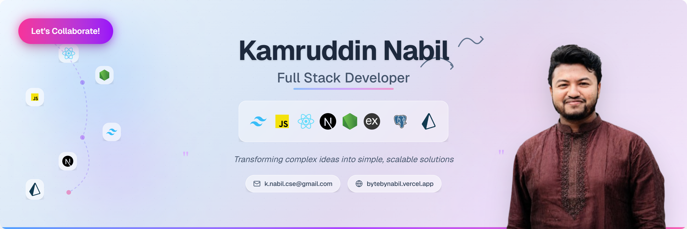
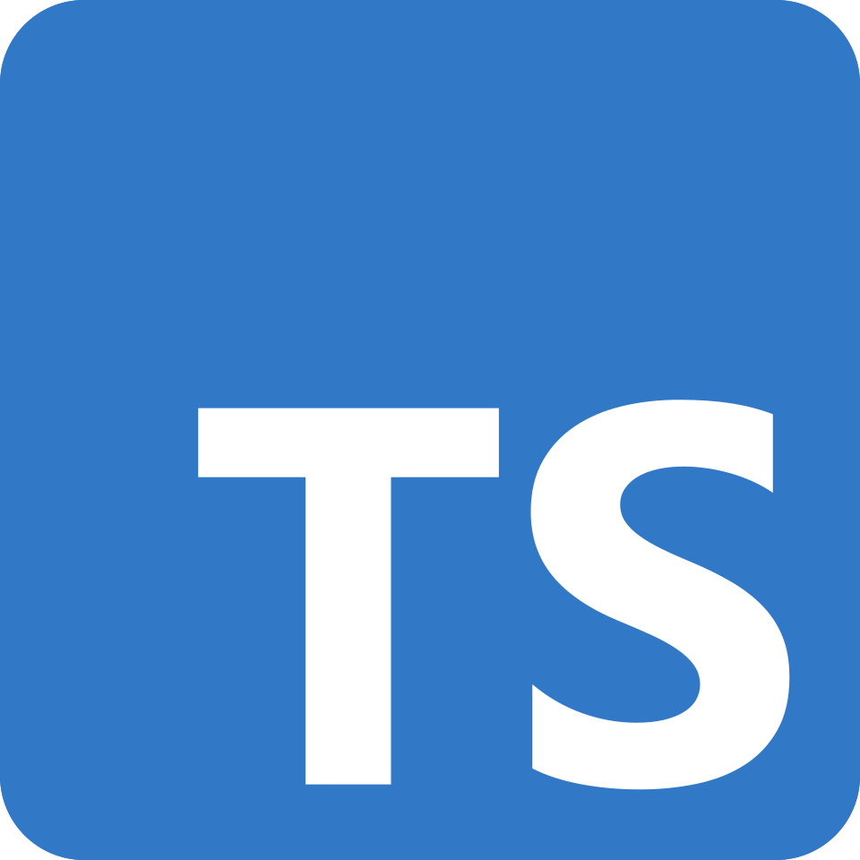
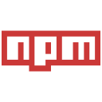

<!-- - visit count --->
<p align="left">  </p>

<!--- banner --->


<br/>

<!--- title --->
<br/>

<h1 align="center">
  <a href="https://git.io/typing-svg">
    
  </a>
</h1>

<div align="center">
  <strong>Full Stack Web Engineer 👋 | Expert in JavaScript, React.js, React Native, Next.js, TypeScript, Node.js, Express.js | Crafting High-Performance Microservices, Scalable Web Apps with MongoDB & PostgreSQL 🌍 </strong>
</div>
<br/>

<div align="center">
  <a href="https://www.linkedin.com/in/kamruddin-nabil-0a128b244/"></a>
  <a href="https://x.com/Mr_Naabil_"></a>
  <a href="mailto:k.nabil.cse@gmail.com"></a>
</div>
<hr/>


### Talking about Personal Stuff

- 🛠 &nbsp; I’m currently working with <strong>JS, TS, React, Node, Express MongoDB, SQL.</strong>
- 🚀 &nbsp; I’m currently exploring <strong>Golang, Blockchain, Docker.</strong>
- 📫 &nbsp; Reach me out: <strong>k.nabil.cse@gmail.com.</strong>

### My Absolute Favorites

- 💻 &nbsp; I love exploring new technologies and building cool stuff.
- 🍕 &nbsp; Meetups & Tech Events & Hackathons.

<hr/>

<h2 align="center">🔥 Languages & Frameworks & Tools 🔥</h2>

<!-- [](https://github.com/ByteByNabil) -->

<div align="center">
  <code></code>
  <code></code>
  <code></code>
  <code></code>
  <code></code>
  <code></code>
  <code></code>
  <code></code>
  <code></code>
  <code></code>
  <code></code>
  <code></code>
  <code></code>
  <code></code>
  <code></code>
  <code></code>
  <code></code>
  <code></code>
  <code></code>
  <code></code>

</div>

<br/>

```javascript
const kamruddinNabil = {
  pronouns: "he/him",
  code: ["JavaScript", "TypeScript", "HTML", "CSS", "Tailwind CSS"],
  tools: [
    "React",
    "NextJs",
    "Node.js",
    "ExpressJs",
    "Docker",
    "Golang",
    "PostgreSql",
    "Prisma",
  ],
  architecture: ["design system pattern"],
  techCommunities: {
    coorganizer: "International Islamic University Chittagong",
    speaker: "English",
    mentor: "Web Developer",
  },
  challenge:
    "I am doing the #100DaysOfCode challenge focused on React and TypeScript",
};
```

<!-- - visit count --->
<p align="left">  </p>
